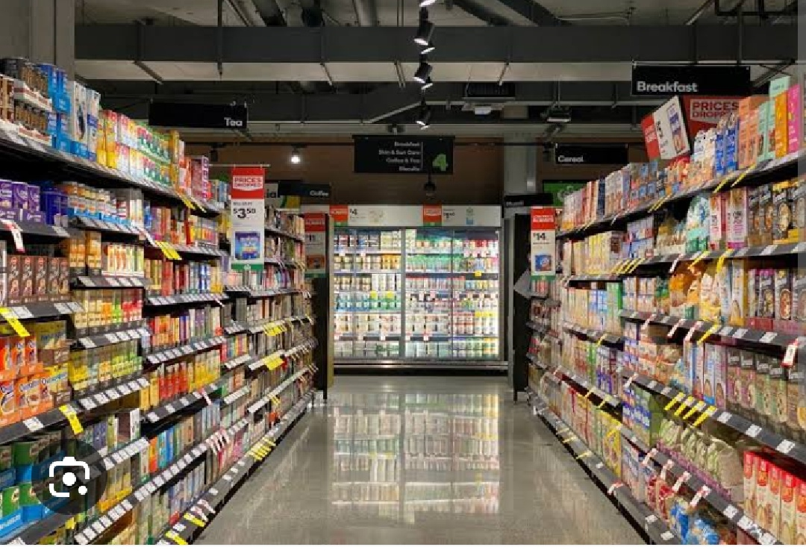
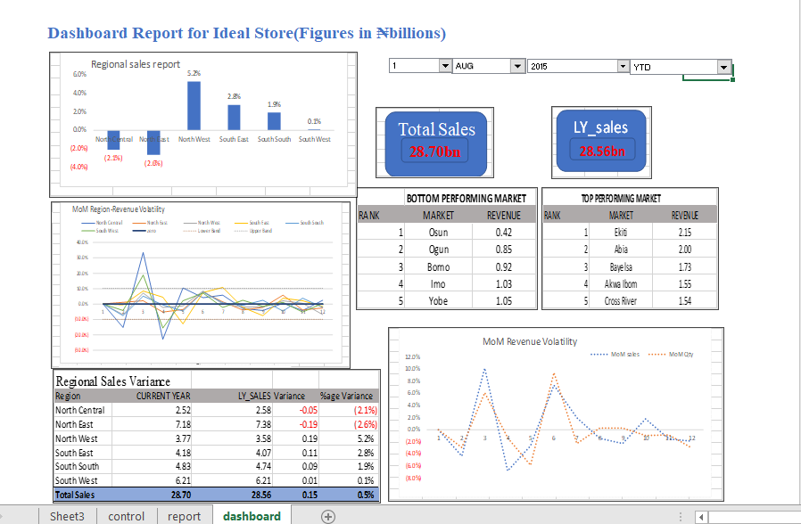
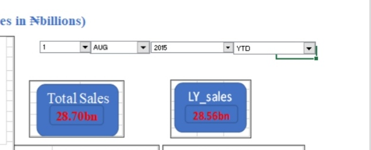
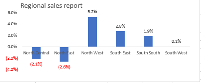
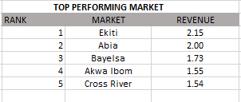
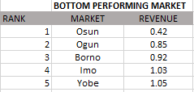
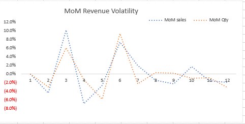
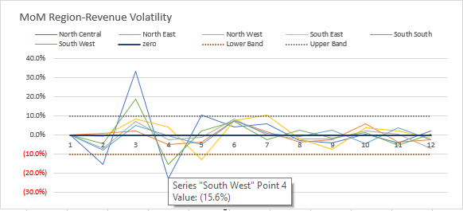

# Ideal-store

## Introduction 
This is a personal advanced Excel project done during my bootcamp training. It is a dummy store with the intention to craft out abilities in using Excel and its features. 

## Problem Statement 
1. What is the store current and previous yearly sales
2. What is the sales per region and the percentage variance
3. What are the top and bottom performing markets
4. What is the MoM region revenue sales volatility 
     
## Skills / Concept Demonstrated 
- Power Query
- Aggregate functions ( Sumifs,       Match-index, Large, Small) 
- Vlookup
- Data Validation 
  
## Analysis
The external data were transformed using **Power Query**
For this Excel project, three sheets were created which are control, report and dashboard.  
These are for the use of both analyst and stakeholders. 
 

The control sheet is where the control button was created for easy access in determining the **YTD**, **QTD**, **MTD** of the company using the developer tool, format tool and combo box. 

1. Current and previous yearly         store sales
  

 Between August 1st 2014 - 2015 financial year, total sales was	28.70 billion naira while the previous year indicated as L_Y sales (Lastyear) was 28.56 billion naira

2. Regional sales report
    
   
 The North West had the highest    sales record and South West has the lowest, however North central and North East shows their sales are lower than expectations. 
   
3. Achieving the top and bottom
   
Top market      |    Bottom market
:--------------:|:---------------:
 | 

Ekiti state tops the best performing table while Osun tops the bottom performing table both from the same region. 

5. MoM revenue sales, quantity and region revenue
   
Sales/Quantity    |   Region revenue
:----------------:|:---------------:
   | 

This determines the monthly growth comparing sales, quantity and region revenue with February and March of this particular financial year with good growth

## Conclusion and Recommendation
### Conclusion
The highest profit between August 2014 - 2015 came from North West region and the months with highest growth is February and March. 

### Recommendation
The last four months of this financial year should be looked into compared to the second, third and fifth month. 
However, for better data driven decision, more financial years should be examined. 
On the bright side, it was a good financial year. 

   
